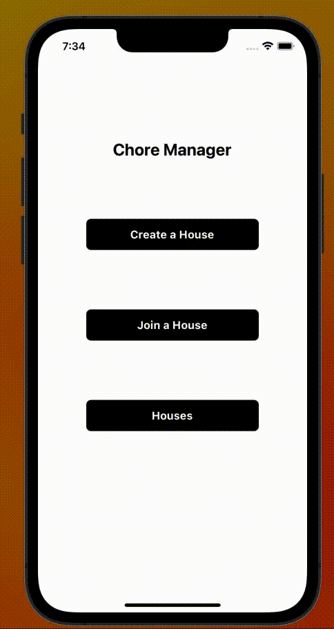

# Chore Manager
The Chore Manager app was designed to create a fair and organized way for young adults, specifically those living with roommates to create a chore schedule every week.

The inspiration to develop this app came from living with my own roommates and always having trouble with who cleans which part of the house this week, or who takes out the trash this week. As a result, we all ended up doing all chores together creating a disorganzied and inefficient chore regimen. 

# Functionality

## User Flow
 
Create a user

Login as existing user

Create a House

Join a House

View Houses
